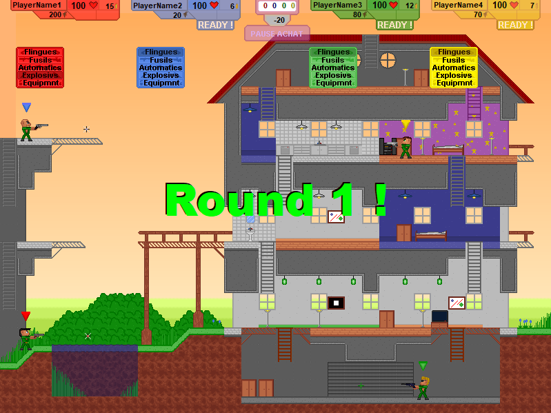
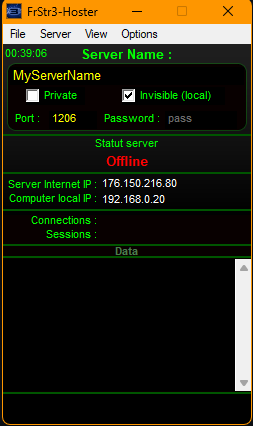
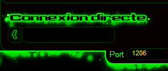
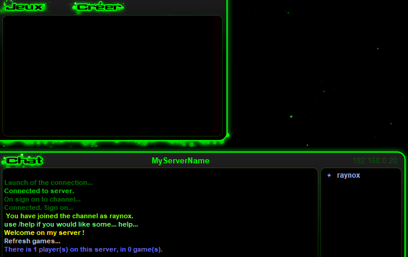

# 🎮 Friendly-Strike 3 on Linux



> **4 joueurs. 1 clavier. 0 limite de fun.**

Tu te souviens de ces heures de permanence au collège, entassés à 4 devant le même PC, les doigts qui se marchent dessus sur le clavier, à essayer de ne pas se faire griller par les pions ? **Friendly-Strike 3**, c'est exactement ça.

Ce projet permet de faire tourner ce petit bijou Windows sur **Linux** grâce à Wine et Podman/Docker. Parce que les bons jeux ne devraient jamais mourir.

---

## 🔥 Pourquoi ce jeu est incroyable

| | |
|---|---|
| 👥 **Jusqu'à 4 joueurs sur UN SEUL CLAVIER** | Oui, c'est le chaos. Oui, c'est génial. Active les touches rémanentes (toutes les 30s) et c'est parti ! |
| 🌐 **Multijoueur LAN** | Organise des LAN parties comme à l'époque. Chaque joueur sur son PC, tous sur le même réseau. |
| 🔫 **48 armes de destruction** | 38 achetables entre les rounds + 10 armes légendaires cachées dans les arènes |
| 💣 **Arsenal tactique** | Grenades, napalm, bombes fumigènes, roquettes télécommandées... |
| 🤖 **IA redoutable** | 4 niveaux de difficulté pour jouer solo ou compléter l'équipe |
| 🏗️ **Éditeur d'arènes** | Crée tes propres maps avec 19 mondes différents |
| 🎯 **Arènes destructibles** | Les murs explosent, les planchers s'effondrent, le chaos s'installe |

*"Be a smart strategist or big barbarian, it's up to you to choose!"*

---

## 📖 L'histoire derrière ce projet

C'est le jeu auquel on jouait à 4 sur un seul clavier en salle de permanence au collège. Des heures de parties endiablées entre deux cours, de trahisons entre potes, de victoires volées à la dernière seconde — en gardant un œil sur la porte au cas où un pion débarque.

Je voulais le faire perdurer et le rendre jouable sur Linux. Mission accomplie.

🌐 **Site officiel** : http://lucas.sonzogni.free.fr/fs3_en.htm

---

## 🚀 Installation rapide

```bash
# Cloner le projet
git clone https://github.com/Raynoxis/friendly-strike-3-container.git
cd friendly-strike-3-container

# Construire l'image
podman build -t friendly-strike3:latest ./build

# Configurer l'audio (une seule fois)
sudo ./scripts/setup-host-audio.sh

# JOUER !
./scripts/run-game.sh
```

---

## 🎮 Modes de jeu

### 🖥️ Solo / Local (jusqu'à 4 joueurs sur 1 PC)

```bash
./scripts/run-game.sh
```

Rassemblez-vous autour du clavier et que le meilleur gagne !

**💡 Astuce Windows** : Activez les touches rémanentes (Sticky Keys) pour éviter les conflits de touches. Le jeu vous proposera de les activer toutes les 30 secondes.

### 🌐 Multijoueur LAN (jusqu'à 4 joueurs en réseau)

Organisez une vraie LAN party ! Chaque joueur sur son PC, tous connectés au même réseau local.

<details>
<summary><b>📋 Guide complet LAN (cliquez pour déplier)</b></summary>

#### Étape 1 : Lancer le serveur

Sur le PC qui héberge :

```bash
./scripts/run-hoster.sh
```

#### Étape 2 : Configurer le serveur



1. Renseigne le nom du serveur, port, mot de passe...
2. Menu **Server** → **Connect** pour lancer l'écoute
3. Note l'adresse **Computer local IP** (ex: `192.168.0.20`)

#### Étape 3 : Rejoindre le serveur

Sur **chaque PC** (y compris l'hébergeur) :

```bash
./scripts/run-game.sh
```

Puis dans le jeu :



1. **Multijoueur** → **Connexion directe**
2. Entre l'IP du serveur (ex: `192.168.0.20`)
3. Port : `1206` (par défaut)

#### Étape 4 : Créer et lancer la partie



1. L'hébergeur clique sur **Créer**
2. Choisis la carte et les options
3. Les autres joueurs rejoignent la partie
4. **GO !**

#### Ports à ouvrir (pare-feu)

| Port | Protocole | Description |
|------|-----------|-------------|
| 1203 | UDP | Port principal |
| 1206 | UDP | Port serveur |

</details>

---

## 🔊 Configuration audio

```bash
# Sortie HDMI
./scripts/select-audio-output.sh hdmi

# Sortie haut-parleurs
./scripts/select-audio-output.sh analog

# Voir les options disponibles
./scripts/select-audio-output.sh list
```

---

## 📁 Structure du projet

```
├── build/                      # Construction de l'image
│   ├── Dockerfile
│   ├── entrypoint.sh
│   └── game/                   # Fichiers du jeu
│
├── scripts/                    # Scripts d'exécution
│   ├── run-game.sh             # Lancer le jeu
│   ├── run-hoster.sh           # Lancer le serveur LAN
│   ├── setup-host-audio.sh     # Config audio
│   └── select-audio-output.sh  # Sélection sortie audio
│
├── docker-compose.yml
└── README.md
```

---

## 🛠️ Commandes utiles

```bash
# Voir les conteneurs en cours
podman ps --filter "name=fs3"

# Arrêter le jeu
podman stop fs3-game

# Arrêter le serveur
podman stop fs3-hoster

# Logs du serveur
podman logs fs3-hoster
```

---

## 📜 Licence

Les fichiers de configuration de ce projet sont libres.
Le jeu **Friendly-Strike 3** reste la propriété de ses auteurs.

---

<div align="center">

**Fait avec ❤️ pour préserver un morceau de notre adolescence**

*Si toi aussi tu as des souvenirs de parties endiablées en salle de perm, donne une ⭐ au projet !*

</div>
